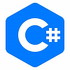
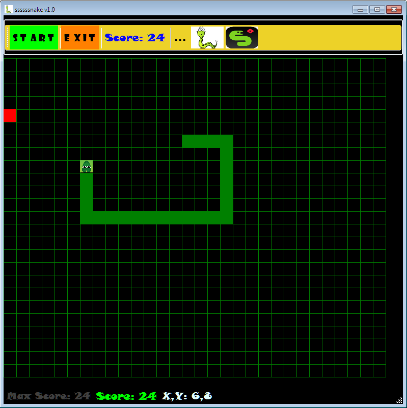
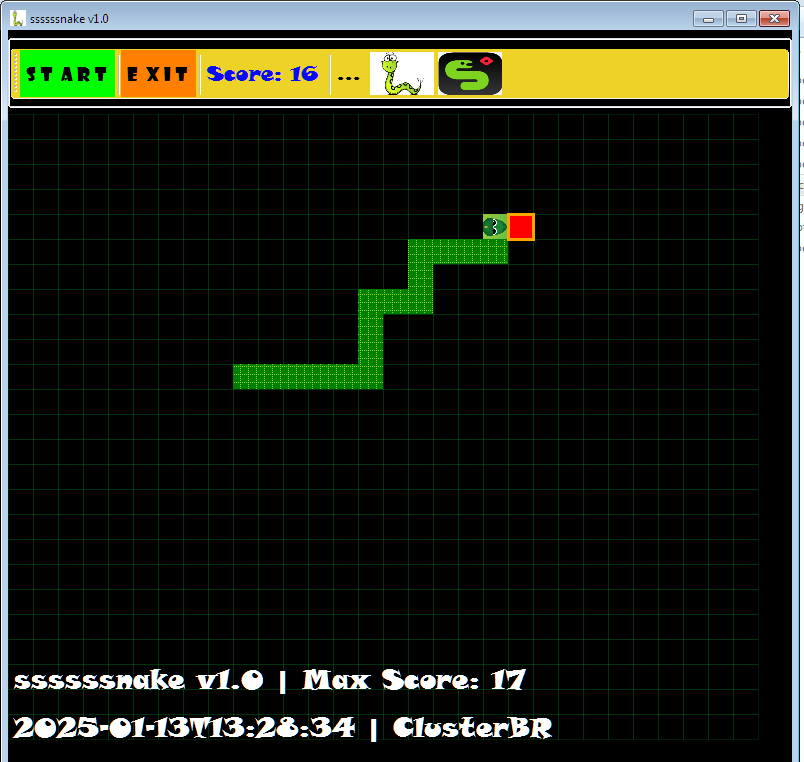
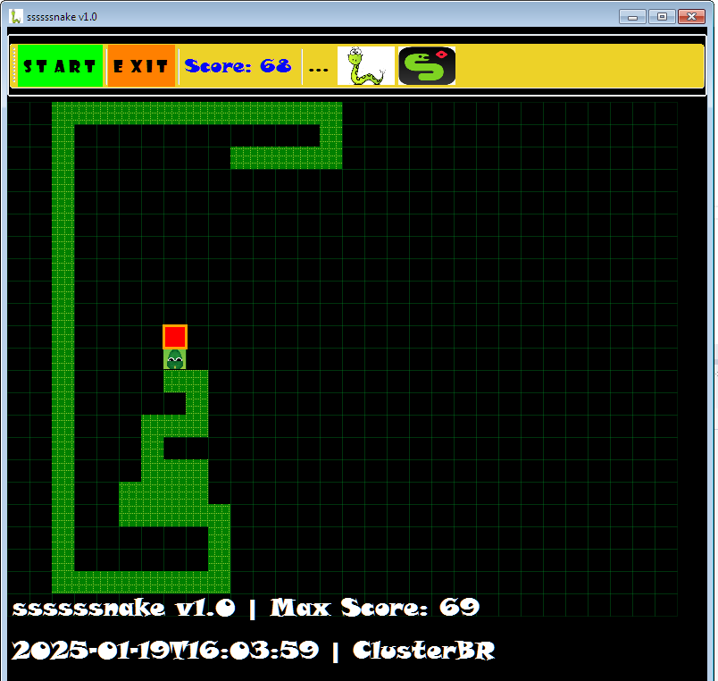

# Snake ssssssnake v1.0


**Snake ssssssnake v1.0** is a classic game where you control a snake to eat food and grow in length. The snake moves in a grid, and every time it eats food, it gets longer, making the game progressively harder. The game ends when the snake collides with itself or the screen boundaries.

> *"bake the snake in the lake"*

(**DIST-repository**)

## Features

- **Grid-based movement**: Control the snake to navigate the grid.
- **Growing snake**: The snake grows in length as it eats food.
- **Score tracking**: The score increases with each food item eaten.
- **Game-over mechanics**: The game ends when the snake collides with itself or the wall.
- **Responsive controls**: Easy-to-use keyboard controls to guide the snake.
- **Simple and intuitive UI**: Clean interface for an easy gameplay experience.

- **MaxScore** value is saved locally in the application's user-configuration file at the following path:
    - `C:\Users\<USER>\AppData\Local\ClusterBR\ssssssnake.exe_<ID>\1.0.0.0\user.config`

## Controls

- **Arrow keys** to move the snake: 
  - **Up, Down, Left, Right**: Moves the ssssssnake
  - **SPACE**: Info / PAUSE
  - **Letter M/m**: Show max-score / PAUSE

## Screenshots

- The executable "**ssssssnake.exe**" can be found in the **dist** folder of this repository:
https://github.com/abritoh/ssssssnake










## Requirements

- **.NET Framework 4.6.1 or higher**
- **Supported Operating Systems**:
  - **Windows 7, 8, 10, 11**
  - **Windows Server**: Windows Server 2008 R2, 2012, 2016, 2019, 2022
    
```csharp
<?xml version="1.0"?>
<configuration>
    <configSections>
        <sectionGroup name="userSettings" type="System.Configuration.UserSettingsGroup, System, Version=4.0.0.0, Culture=neutral, PublicKeyToken=b77a5c561934e089">
            <section name="ClusterBR.Properties.Settings" type="System.Configuration.ClientSettingsSection, System, Version=4.0.0.0, Culture=neutral, PublicKeyToken=b77a5c561934e089" allowExeDefinition="MachineToLocalUser" requirePermission="false"/>
        </sectionGroup>
    </configSections>
    <startup> 
        <supportedRuntime version="v4.0" sku=".NETFramework,Version=v4.6.1"/>
    </startup>
    <userSettings>
        <ClusterBR.Properties.Settings>
            <setting name="MaxScore" serializeAs="String">
                <value>0</value>
            </setting>
            <setting name="MaxScoreDT" serializeAs="String">
                <value>2025-01-11</value>
            </setting>
        </ClusterBR.Properties.Settings>
    </userSettings>
</configuration>
```

## Programming Language

- **C#**

```csharp
...

protected override void OnPaint(PaintEventArgs e) {

    base.OnPaint(e);
    Graphics g = e.Graphics;            

    Pen gridPen = new Pen(Color.FromArgb(40, 1, 171, 43), 1.5f);
    for (int y = 0; y < Settings.GRID_DIMENSION_Y; y++) {
        for (int x = 0; x < Settings.GRID_DIMENSION_X; x++) {
            g.DrawRectangle(gridPen, x * Settings.GRID_ITEM_SIZE, y 
                * Settings.GRID_ITEM_SIZE + Settings.BTN_BAR_AREA_HEIGHT, 
                Settings.GRID_ITEM_SIZE, Settings.GRID_ITEM_SIZE);
        }
    }
    gridPen.Dispose();

    HatchBrush snakeBrush = new HatchBrush(HatchStyle.DottedGrid, Color.YellowGreen, Color.Green);
    for (int i = 0; i < snake.Count; i++) {
        var segment = snake[i];
        if (i == 0) {
            PointF center = new PointF(segment.X * 
                Settings.GRID_ITEM_SIZE + Settings.GRID_ITEM_SIZE / 2, 
                segment.Y * Settings.GRID_ITEM_SIZE + 
                Settings.GRID_ITEM_SIZE / 2 + Settings.BTN_BAR_AREA_HEIGHT);
            g.TranslateTransform(center.X, center.Y);
            switch (currentDirection) {
                case Directions.Up: g.RotateTransform(270); break;
                case Directions.Down: g.RotateTransform(90); break;
                case Directions.Left: g.RotateTransform(180); break;
                case Directions.Right: g.RotateTransform(0); break;
            }
            g.DrawImage(snakeHeadImage, -Settings.GRID_ITEM_SIZE / 2, 
                -Settings.GRID_ITEM_SIZE / 2, Settings.GRID_ITEM_SIZE, Settings.GRID_ITEM_SIZE);
            g.ResetTransform();
        }
        else {
            g.FillRectangle(snakeBrush, segment.X * Settings.GRID_ITEM_SIZE, 
                segment.Y * Settings.GRID_ITEM_SIZE + Settings.BTN_BAR_AREA_HEIGHT, 
                Settings.GRID_ITEM_SIZE, Settings.GRID_ITEM_SIZE);                    
        }
    }
    snakeBrush.Dispose();

    Pen foodPen = new Pen(Color.Orange);
    foodPen.Width = 3.0f; Brush foodBrush = new SolidBrush(Color.Red);
    g.FillRectangle(foodBrush, pointFood.X * Settings.GRID_ITEM_SIZE, 
        pointFood.Y * Settings.GRID_ITEM_SIZE + Settings.BTN_BAR_AREA_HEIGHT, 
        Settings.GRID_ITEM_SIZE, Settings.GRID_ITEM_SIZE);
    g.DrawRectangle(foodPen, pointFood.X * Settings.GRID_ITEM_SIZE, 
        pointFood.Y * Settings.GRID_ITEM_SIZE + Settings.BTN_BAR_AREA_HEIGHT,
        Settings.GRID_ITEM_SIZE, Settings.GRID_ITEM_SIZE);

    if (gameOver) {                
        LabelMessage.ForeColor = Color.Red;
        LabelMessage.Text = Settings.MSG_GAME_OVER;
    }
    foodPen.Dispose(); foodBrush.Dispose();
}

...
```

> ClusterBR  | arcebrito@gmail.com (c) 2025